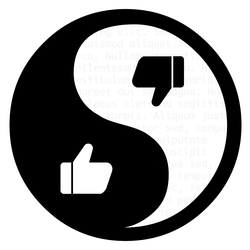

# Karma Bot

Karma is a Bot for [Telegram](https://telegram.org/) to keet control of the user's reputation in a group.

## How to use

### Start bot
```
/start
```
This command is needed to initialize the group. You must call before any other commands.

### Add positive karma
```
/karma @username++
```

This command is used to add positive karma (or reputation) to a user.   
*(You can add a empty space after username)*

### Add negative karma
```
/karma @username--
```

This command is used to add negative karma (or reputation) to a user.  
*(You can add a empty space after username)*

### Top 3 Users
```
/usertop
```

This command show the top 3 users with more positive karma in a group.

### See user reputation
```
/karma @username?
```

This command is used to see user's karma.  
*(You can add a empty space after username)*

## Issues
If you find a problem with the bot you can open a issue [here](https://github.com/franexposito/karma-bot-telegram/issues).

## Improvements
I am open to add new features. If you have an idea just let me know [here](https://github.com/franexposito/karma-bot-telegram/issues).  
*(Open a issue with enhancement tag)*.

## Contribute to Karma Bot
Contributions are always welcome, no matter how large or small.


